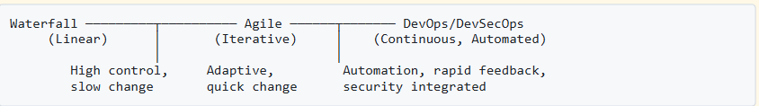
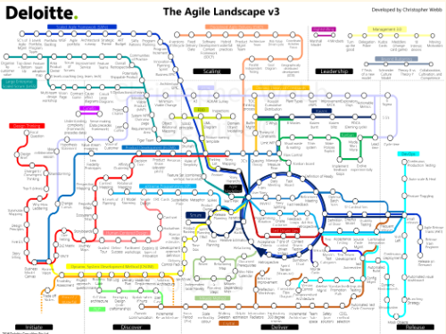

# Week 9

## SE Methodolgies

## Why SE Methodologies matter

- Repeatability: Reduces chaos and reinvention
- Quality: Promotes robust, testable software
- Teamwork: Coordinates work, roles and communication
- Risk reduction

### Key question
- How do process choices affect software outcomes?

## Methodology Spectrum

## Agile
### Principles and practices
- Short, frequent cycles
- collaboration
- adaptibility
- continous feedback
#### Popular frameworks
    - Scrum
    - kanban
        - Visualize workflow, limit work-in-progroess
        - Pull based, continous flow
    - Xp
        - Pair programming
### Strengths and weaknesses
- Strengths:
    - Rapid response to change
    - Transparency and communication
    - Early and continous delivery
- Weaknesses
    - Can lack documenation 
    - Hard in highly regulated systems
    - Needs high discipline

### A Complex Ecosystem

- **Agile is not a single methodology**, Its a ecosystem of frameworks, practices, and concepts

### Concepts and Approaches 
- Test driven development
    - Write tests before code
    - Red, green, refactor cycle
    - Ensures testability
- Behaviour-Driven Development
    - Describes behavior 